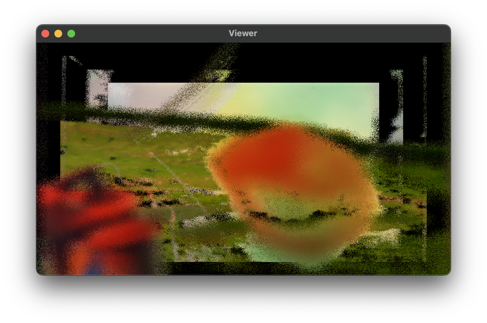
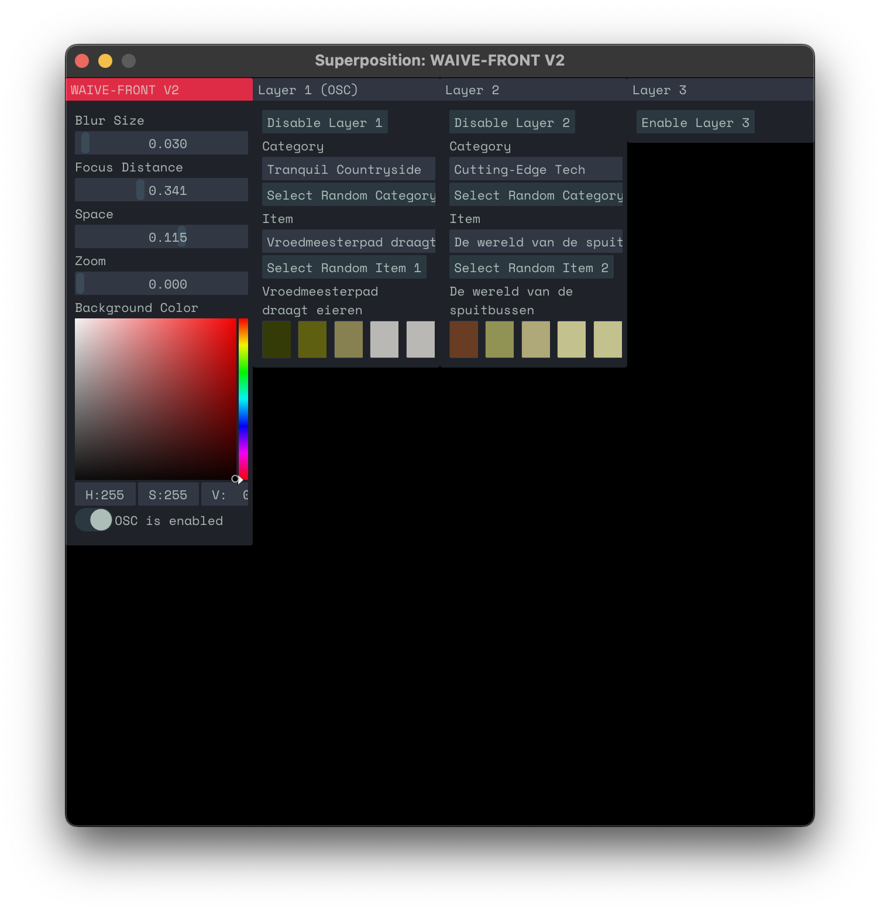

# WAIVE-FRONT V2

[](https://superpositioncc.github.io/waive-front-v2) [](#) [](https://superpositioncc.github.io/waive-front-v2)

<p align="center">
	
	
</p>

<p align="center">
<em>Interactive, fully automatable visual generation software based on European digital cultural heritage archives.</em>
</p>

# Usage

1. First of all, download the footage and metadata zip from [here](https://drive.google.com/file/d/1h3WZgfrcJxJCwXs8iOBzoWD9DIgm0oJs/view?usp=sharing). Unzip it into your Documents folder. You should be left with this structure:


```
Users/
├─ Your Name/
│  ├─ Documents/
│  │  ├─ WAIVE/
│  │  │  ├─ categories.json
│  │  │  ├─ stichting_natuurbeelden
│  │  │  ├─ ...
```

⚠️ **Make sure these files are in the correct place, otherwise WAIVE-FRONT won't be able to find them.**

2. (Linux / MacOS) Next, make sure you have `ffmpeg` version 7.0.1 installed. On MacOS, the easiest way to do this is using `homebrew`.
3. (Windows) Download the required ffmpeg dlls from [here](https://drive.google.com/file/d/1rDx3mzgxlll8r4aVG2g8qDa2BbFhSlgC/view?usp=share_link). Place the DLL files in the same folder as your DAW's exe file. This will usually be in your Program Files or ProgramData directory. For example, if Ableton Live was installed in `C:\ProgramData\Ableton\[Live Version]\Program`, place the DLL files right next to Ableton's exe file there. *Note: Due to FFMPEG licensing restrictions, we cannot make this process easier at this point.*
4. Download the build for your operating system from the [releases](https://github.com/superpositioncc/waive-front-v2/releases) page, or build it yourself from the instructions below. Choose which plugin format you prefer and place it in your plugins path of your DAW. 

Common (system-wide) plugin paths:
      
|         | VST2                                 | VST3*                                | Audio Units                                 |
| ------- | ------------------------------------ | ------------------------------------ | ------------------------------------ |
| macOS   | `Library/Audio/Plug-ins/VST3`        | `Library/Audio/Plug-ins/VST3`        | `Library/Audio/Plug-ins/Components`        |
| Linux   | `/usr/lib/vst`                       | `/usr/lib/vst3`                      | *n/a*                      |
| Windows | `C:\Program Files\Common Files\VST2` | `C:\Program Files\Common Files\VST3` | *n/a* |
      
In your DAW, rescan plugins if it does not automatically. 

# OSC control

WAIVE-FRONT needs UDP port 8000 to be available, because it will listen for OSC messages there. This way, you can use [WAIVE](https://github.com/ThunderboomRecords/WAIVE) to control the visuals.

# Build instructions

**Dependencies** *On MacOS, both of these can be installed using Homebrew.*  

`nlohmann-json@3.11.3`  
`ffmpeg@7.0.1`

```bash
git clone --recursive https://github.com/superpositioncc/waive-front-v2
cd waive-front-v2

# To clean the build folder
make clean

# To build all available targets
make

# To build specific targets
make au
make vst
make vst3
make jack

# To run a standalone (JACK) build
make run

# To install the VST2, VST3 and AU (on MacOS) builds
make install
```

# Development

Want to add new features or improve on existing ones? Squash some bugs? Pull requests are very welcome! Documentation for the code is available [here](https://superpositioncc.github.io/waive-front-v2/).

# Shipping on MacOS

Building a fully functional and production-ready version on MacOS requires a paid Apple Developer plan.

1. Copy `Icon.icns` from the `assets` folder into the App Bundle's `Contents/Resources` folder. Create the folder if it does not exist.
2. Copy `Info.plist` from the `assets` folder into the App Bundle's `Contents` folder, overwriting the one that is already there.
3. Obtain your Team ID and an app-specific password from the Apple Developer website. Create a Developer ID Application certificate and install on your system, using XCode.
4. Run `security find-identity -p basic -v` and note the hash of the Developer ID Application certificate.
5. Navigate to the folder that contains the app.
6. Run `codesign --deep --force --options=runtime --entitlements <path_to_entitlements.plist> --sign <hash_of_certificate> --timestamp WAIVE-FRONT-V2.app` to sign the app bundle. Replace `entitlements.plist` can be found in the `assets` folder.
7. Run `zip -r WAIVE-FRONT-V2.zip WAIVE-FRONT-V2.app` to create a zip archive.
8. Run `xcrun notarytool submit WAIVE-FRONT-V2.zip --apple-id <your_apple_id_email_address> --password <your_app_specific_password> --team-id <your_team_id> --wait` to send the app to Apple for notarization.
9. If all went well, `spctl -vvv --assess --type exec WAIVE-FRONT-V2.app` should return `accepted`.
10. Your zip file is ready to ship.
