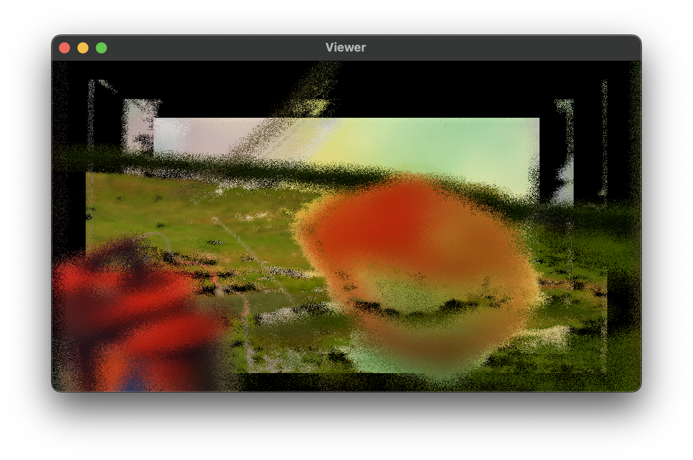
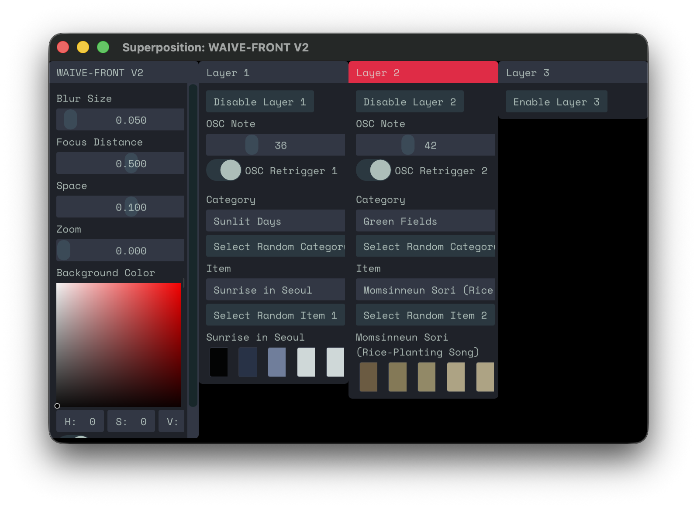

# WAIVE-FRONT V2

[](https://superpositioncc.github.io/waive-front-v2) [](#) [](https://superpositioncc.github.io/waive-front-v2)

<p align="center">
	
	
</p>

<p align="center">
<em>Interactive, fully automatable visual generation software based on European digital cultural heritage archives.</em>
</p>

# Quick Start (for non-coders)

Follow these instructions to get started. WAIVE-FRONT runs on macOS 11 or later (Apple Silicon and Intel) and on 64-bit Windows, as a plugin in your DAW. On macOS there is also a standalone app.

### 1. Install the WAIVE-FRONT datasets
<details>
<summary>
<i>Click to open instructions</i>
</summary>

WAIVE-FRONT plays footage from datasets in a folder called `WAIVE` in your Documents folder. Each dataset is a separate download, so you can pick the ones you want.

1. Make a folder called `WAIVE` in your Documents folder.
2. Download [WAIVE-categories.zip](https://drive.google.com/file/d/1Bv2eMDq0rqNdMuvZMONEh8x8oZVxo0a_/view) and unzip it. Put `categories.json` in the `WAIVE` folder. Every dataset needs it.
3. Download one or more datasets, unzip them, and put each folder in the `WAIVE` folder:

| Dataset | Footage | Size |
| --- | --- | --- |
| [Nederlands Instituut voor Beeld en Geluid](https://drive.google.com/file/d/1gNC-kT3sONnIYjJAJvSYsSKZHraRkYOP/view) | 1,076 clips from 466 Dutch archive films, via Open Images | 1.1 GB |
| [Stichting Natuurbeelden](https://drive.google.com/file/d/1TRYZakO6LTrtVY24AUKIea3ko9FrI6Bd/view) | 367 clips from 184 Dutch nature films, via Open Images | 560 MB |
| [KBS Korean Broadcasting System](https://drive.google.com/file/d/19f7rZviR9VTdZKWZsR8PTnJcpBozCkAQ/view) | 234 clips from 59 videos by Korean public institutions, for the SeMA x Thunderboom Sound Lab | 790 MB |

You should be left with this structure:

```
Users/
├─ Your Name/
│  ├─ Documents/
│  │  ├─ WAIVE/
│  │  │  ├─ categories.json
│  │  │  ├─ kbs_korean_broadcasting_system
│  │  │  ├─ stichting_natuurbeelden
│  │  │  ├─ ...
```

⚠️ **Make sure these files are in the correct place, otherwise WAIVE-FRONT won't be able to find them. If you run into any problems, this is the first thing you should check.**

The Korean footage is licensed under the Korea Open Government License, Type 1 or Type 2. Type 2 allows non-commercial use only. `CREDITS.md` in its folder lists every video with its institution, licence and source.
</details>

### 2. Install WAIVE-FRONT

<details>
<summary>
<i>Click to open instructions</i>
</summary>

Download the build for your operating system from the [releases](https://github.com/superpositioncc/waive-front-v2/releases) page and place the plugin in the plugins folder of your DAW. On macOS there is a VST3, an Audio Unit (for Logic Pro and GarageBand) and a standalone app; put the app in your Applications folder. On Windows there is a VST3. On macOS, the simplest way to open these folders is by opening Finder and then pressing `cmd+shift+g`, and pasting the path from below.

Common (system-wide) plugin paths. On macOS, `~/Library/Audio/Plug-Ins/VST3` and `~/Library/Audio/Plug-Ins/Components` work as well, without asking for your password.

|         | VST3                                 | Audio Units                          |
| ------- | ------------------------------------ | ------------------------------------ |
| macOS   | `/Library/Audio/Plug-ins/VST3`       | `/Library/Audio/Plug-ins/Components` |
| Windows | `C:\Program Files\Common Files\VST3` | _n/a_                                |

In your DAW, rescan plugins if it does not automatically. The first time WAIVE-FRONT starts, macOS asks whether it may use your Documents folder, where the footage is; allow it.

To show the visuals fullscreen, for instance on a projector: drag the Viewer window to that screen, then double-click it or press `F`. Press `Esc` or double-click again to leave fullscreen.

### Communication with WAIVE

If you use both [WAIVE](https://github.com/ThunderboomRecords/WAIVE) and WAIVE-FRONT at the same time on the same computer, they should communicate out of the box if your project is playing in your DAW.

WAIVE-FRONT needs UDP port 8000 to be available, because it will listen for OSC messages there. This way, WAIVE, or any other software that sends OSC, can control the visuals.
</details>

&nbsp;

🎉 That's it, you're ready to start VJ'ing!

# Build instructions (for coders)

<details>
<summary>
<i>If you're interested in developing with us, click here to open build instructions</i>
</summary>

_Note: as of yet, Linux builds have been untested and therefore disabled in CMakeLists.txt. It should be straightforward to adjust the build steps to work on Linux. Please feel free to contribute with a pull request!_

The following steps have been written with MacOS users in mind. For Windows, the easiest way to build is to load the project into Visual Studio and run CMake from there -- it should work out of the box.

WAIVE-FRONT links FFmpeg statically, so the builds run without installing anything. You don't need to install FFmpeg yourself either:

- **macOS:** CMake builds a small FFmpeg 8.1 from source (`scripts/build-ffmpeg.sh`, about a minute). You only need the Xcode command line tools. For a universal build, pass `-DCMAKE_OSX_ARCHITECTURES="arm64;x86_64"` and install `nasm` (`brew install nasm`); without it the Intel part decodes more slowly.
- **Windows:** without further options CMake downloads a shared FFmpeg and copies its DLLs next to the binaries. That is fine for development, but large. The release builds use a static FFmpeg made with `scripts/build-ffmpeg.sh` in MSYS2 and passed with `-DWAIVE_FFMPEG_ROOT=<prefix>`; see `.github/workflows/build.yml`.
- To link against the FFmpeg on your system instead (e.g. from Homebrew), pass `-DWAIVE_SYSTEM_FFMPEG=ON`. The binaries then only run where the same FFmpeg is installed.

1. Clone the Git repository.
   ```bash
   git clone https://github.com/superpositioncc/waive-front-v2
   cd waive-front-v2
   ```
2. Create the `build` directory and step into it.
   ```bash
   mkdir build && cd build
   ```
3. Run CMake script. Required dependencies will automatically be downloaded according to your operating system.
   ```bash
   cmake ..
   ```
4. Run the generated Makefile.
   ```bash
   make
   ```
5. Your binaries will be in the `build/bin` directory.
6. Documentation for the code can be built by running `doxygen` in the root directory of this repository.

Every push and pull request is built for macOS (universal) and Windows by `.github/workflows/build.yml`. The builds can be downloaded from the run's artifacts.

## Development

Want to add new features or improve on existing ones? Squash some bugs? Pull requests are very welcome! Documentation for the code is available [here](https://superpositioncc.github.io/waive-front-v2/).

## Releasing

1. Push a tag, for example `git tag v2.2 && git push origin v2.2`.
2. The workflow builds macOS and Windows, signs and notarises the macOS builds, and makes a draft release with one zip per format.
3. Check the draft on the [releases](https://github.com/superpositioncc/waive-front-v2/releases) page and publish it.

Signing and notarising on macOS need a paid Apple Developer account and five repository secrets (Settings, Secrets and variables, Actions):

| Secret | What |
| --- | --- |
| `MACOS_CERTIFICATE` | The Developer ID Application certificate with its private key, exported from Keychain Access as `.p12`, then base64: `base64 -i certificate.p12` |
| `MACOS_CERTIFICATE_PASSWORD` | The password set when exporting the `.p12` |
| `APPLE_ID` | The Apple ID of the developer account |
| `APPLE_APP_PASSWORD` | An app-specific password for that Apple ID, made at account.apple.com |
| `APPLE_TEAM_ID` | The team ID, on developer.apple.com under Membership details |

Without them the builds are made unsigned. To sign on your own Mac instead, run `scripts/package-macos.sh build/bin <output dir>` with `MACOS_SIGN_IDENTITY`, `APPLE_ID`, `APPLE_APP_PASSWORD` and `APPLE_TEAM_ID` set.
</details>
