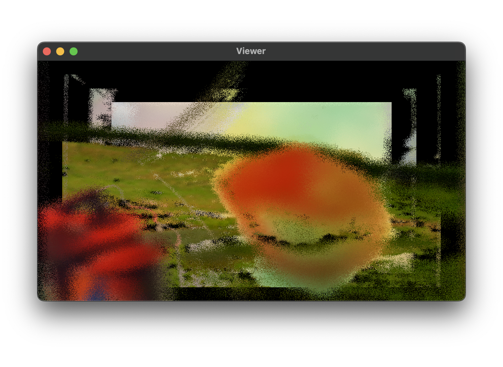

# WAIVE-FRONT V2




# Usage

First of all, download the footage and metadata zip from [here](https://drive.google.com/file/d/1h3WZgfrcJxJCwXs8iOBzoWD9DIgm0oJs/view?usp=sharing). Unzip it into your Documents folder. You should be left with this structure:

```
Users/
├─ Your Name/
│  ├─ Documents/
│  │  ├─ WAIVE/
│  │  │  ├─ categories.json
│  │  │  ├─ stichting_natuurbeelden
│  │  │  ├─ ...
```

❗ Make sure these files are in the correct place, otherwise WAIVE-FRONT won't be able to find them.

Download the build for your operating system from the *releases* page and install it to the correct location, or build it yourself from the instructions below.

# OSC control

WAIVE-FRONT needs UDP port 8000 to be available, because it will listen for OSC messages there. This way, you can use [WAIVE](https://github.com/ThunderboomRecords/WAIVE) to control the visuals.

# Build instructions

Make sure you have installed the `ffmpeg` libraries (tested with version 7.0.1).

```bash
git clone --recursive https://github.com/superpositioncc/waive-front-v2
cd waive-front-v2

# To clean the build folder
make clean

# To build all available targets
make

# To build specific targets
make au
make vst
make vst3
make jack

# To run a standalone (JACK) build
make run

# To install the VST2, VST3 and AU (on MacOS) builds
make install
```
