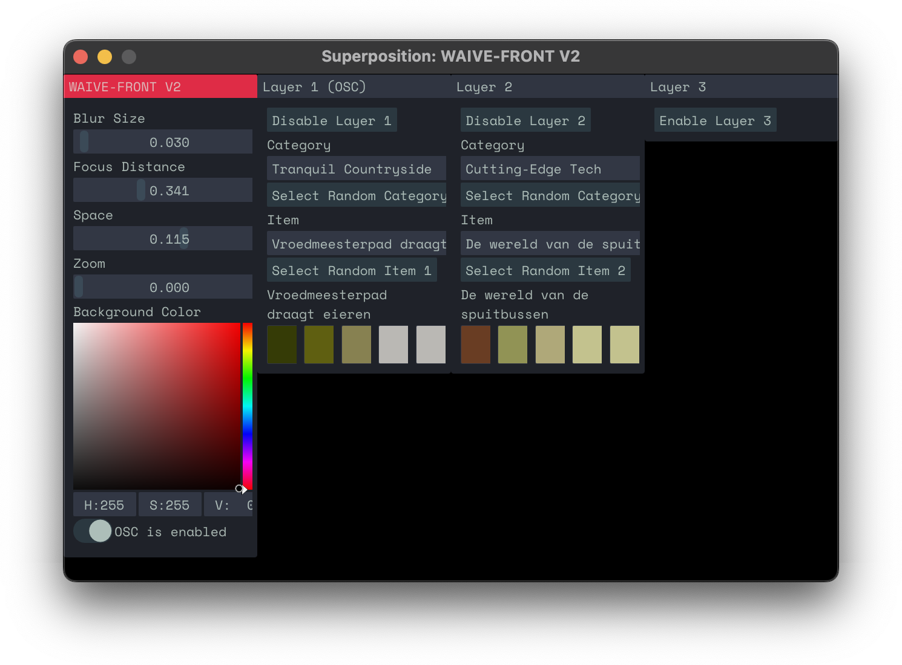

# WAIVE-FRONT V2

[](https://superpositioncc.github.io/waive-front-v2) [](#) [](https://superpositioncc.github.io/waive-front-v2)

<p align="center">
	
	
</p>

<p align="center">
<em>Interactive, fully automatable visual generation software based on European digital cultural heritage archives.</em>
</p>

# Quick Start (for non-coders)

## 1. Install the WAIVE-FRONT dataset

First of all, download the footage and metadata zip from [here](https://drive.google.com/file/d/1h3WZgfrcJxJCwXs8iOBzoWD9DIgm0oJs/view?usp=sharing). Unzip it into your Documents folder. You should be left with this structure:

```
Users/
├─ Your Name/
│  ├─ Documents/
│  │  ├─ WAIVE/
│  │  │  ├─ categories.json
│  │  │  ├─ stichting_natuurbeelden
│  │  │  ├─ ...
```

⚠️ **Make sure these files are in the correct place, otherwise WAIVE-FRONT won't be able to find them.**

## 2. Install FFmpeg

`ffmpeg` is an open-source library that WAIVE-FRONT depends upon to read and display video files. Before you can use WAIVE-FRONT, you need to install `ffmpeg`, specifically version 7.0.1. Follow the instructions for your operating system below.

### macOS

On macOS, the easiest way to install FFmpeg is using `homebrew`.

1. Open the Terminal app

   + Click on the magnifying glass icon in the top right corner of your screen
   + Type "Terminal" and press Enter to open it

2. Install Homebrew (if you haven't already)
   + Copy and paste this command into Terminal:  
      `/bin/bash -c "$(curl -fsSL https://raw.githubusercontent.com/Homebrew/install/HEAD/install.sh)"`

   + Press Enter and follow any on-screen instructions  
      *Note: if you're asked to type your password, you won't be able to see the characters you are typing. Just type your password and press Enter.*

   + Type this command and press Enter:  
      `brew update`

3. Install ffmpeg 7.0.1 (if you haven't already)
   + Type this command and press Enter:  
      `brew install ffmpeg@7.0.1`
   + Wait for the installation to complete. This may take a few minutes. You'll see text scrolling in the Terminal window.
   + Once it's done, type this command and press Enter:  
      `ffmpeg -version`  
      You should see information about ffmpeg, including the version number 7.0.1

That's it, you can continue on to step 3.

### Windows

Download the required ffmpeg dlls from [here](https://drive.google.com/file/d/1rDx3mzgxlll8r4aVG2g8qDa2BbFhSlgC/view?usp=share_link). Place the DLL files in the same folder as your DAW's exe file. This will usually be in your Program Files or ProgramData directory. For example, if Ableton Live was installed in `C:\ProgramData\Ableton\[Live Version]\Program`, place the DLL files right next to Ableton's exe file there. \*Note: Due to FFMPEG licensing restrictions, we cannot make this process easier at this point.

### Linux

Follow the instructions [here](https://www.geeksforgeeks.org/how-to-install-ffmpeg-in-linux/).

## 3. Install WAIVE-FRONT

Download the build for your operating system from the [releases](https://github.com/superpositioncc/waive-front-v2/releases) page. Choose which plugin format you prefer and place it in the plugins path of your DAW. On macOS, the simplest way to open these folders is by opening Finder and then pressing `cmd+shift+g`, and pasting the path from below.

Common (system-wide) plugin paths:

|         | VST2                                 | VST3                                 | Audio Units                         |
| ------- | ------------------------------------ | ------------------------------------ | ----------------------------------- |
| macOS   | `/Library/Audio/Plug-ins/VST3`        | `/Library/Audio/Plug-ins/VST3`        | `/Library/Audio/Plug-ins/Components` |
| Linux   | `/usr/lib/vst`                       | `/usr/lib/vst3`                      | _n/a_                               |
| Windows | `C:\Program Files\Common Files\VST2` | `C:\Program Files\Common Files\VST3` | _n/a_                               |

In your DAW, rescan plugins if it does not automatically. That's it, you're ready to start VJ'ing!

### Communication with WAIVE

If you use both [WAIVE](https://github.com/ThunderboomRecords/WAIVE) and WAIVE-FRONT at the same time on the same computer, they should communicate out of the box if your project is playing in your DAW.

WAIVE-FRONT needs UDP port 8000 to be available, because it will listen for OSC messages there. This way, you can use   to control the visuals. 

# Build instructions (for coders)

_Note: as of yet, Linux builds have been untested and therefore disabled in CMakeLists.txt. It should be straightforward to adjust the build steps to work on Linux. Please feel free to contribute with a pull request!_

The following steps have been written with MacOS users in mind. For Windows, the easiest way to build is to load the project into Visual Studio and run CMake from there -- it should work out of the box.

1. **(MacOS)** Make sure you have `ffmpeg` version 7.0.1 installed. On MacOS, the easiest way to do this is using `homebrew`.
2. Clone the Git repository.
   ```bash
   git clone --recursive https://github.com/superpositioncc/waive-front-v2
   cd waive-front-v2
   ```
3. Create the `build` directory and step into it.
   ```bash
   mkdir build && cd build
   ```
4. Run CMake script. Required dependencies will automatically be downloaded according to your operating system.
   ```bash
   cmake ..
   ```
5. Run the generated Makefile.
   ```bash
   make
   ```
6. Your binaries will be in the `build/bin` directory.
7. Documentation for the code can be built by running `doxygen` in the root directory of this repository.

# Development

Want to add new features or improve on existing ones? Squash some bugs? Pull requests are very welcome! Documentation for the code is available [here](https://superpositioncc.github.io/waive-front-v2/).

# Shipping on MacOS

Building a fully functional and production-ready version on MacOS requires a paid Apple Developer plan.

1. Copy `Icon.icns` from the `assets` folder into the App Bundle's `Contents/Resources` folder. Create the folder if it does not exist.
2. Copy `Info.plist` from the `assets` folder into the App Bundle's `Contents` folder, overwriting the one that is already there.
3. Obtain your Team ID and an app-specific password from the Apple Developer website. Create a Developer ID Application certificate and install on your system, using XCode.
4. Run `security find-identity -p basic -v` and note the hash of the Developer ID Application certificate.
5. Navigate to the folder that contains the app.
6. Run `codesign --deep --force --options=runtime --entitlements <path_to_entitlements.plist> --sign <hash_of_certificate> --timestamp WAIVE-FRONT-V2.app` to sign the app bundle. Replace `entitlements.plist` can be found in the `assets` folder.
7. Run `zip -r WAIVE-FRONT-V2.zip WAIVE-FRONT-V2.app` to create a zip archive.
8. Run `xcrun notarytool submit WAIVE-FRONT-V2.zip --apple-id <your_apple_id_email_address> --password <your_app_specific_password> --team-id <your_team_id> --wait` to send the app to Apple for notarization.
9. If all went well, `spctl -vvv --assess --type exec WAIVE-FRONT-V2.app` should return `accepted`.
10. Your zip file is ready to ship.
